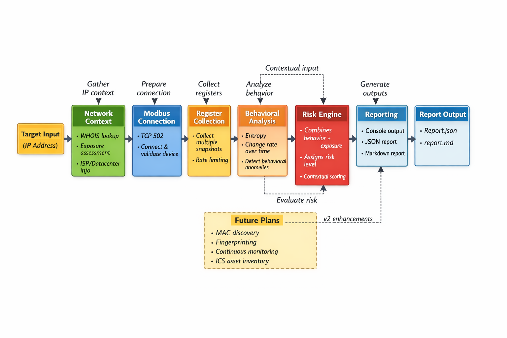

# MEA – Modbus Exposure Analyzer


**MEA** is a behavioral analysis tool for assessing the exposure of Modbus devices. It detects **simulated, non-responsive, or exposed devices** through passive register analysis, providing actionable insights for **pentesters, security researchers, and blue teams** operating in ICS/OT environments.

---

## Key Features

* Modbus TCP connectivity (port 502)
* Register snapshot collection with rate limiting
* Entropy & behavioral analysis of register values
* Detect simulated or fixed datasets
* Public exposure and IP ownership assessment
* Risk scoring engine
* JSON & Markdown reporting
* Console-based summary output

---

## Architecture Overview

<p align="center">
  
</p>

---

## Architecture Explanation

### 1. Target Input

The user provides a **target IP** to analyze. MEA validates input to prevent invalid connections or accidental scans.


### 2. Network Context & Exposure Assessment

MEA first gathers **IP ownership and network context**:

* Determines whether the target is **publicly reachable** or internal
* Fetches ISP/datacenter information using WHOIS
* Categorizes exposure for risk scoring


### 3. Modbus Connection

MEA connects to the Modbus service (default port 502):

* Establishes TCP session
* Handles connection failures gracefully
* Supports **early exit** if the device is non-responsive


### 4. Register Collection

MEA collects **multiple snapshots** of Modbus registers:

* Default window: 5 snapshots
* Rate-limited to avoid detection or overload
* Captures values for behavioral comparison


### 5. Behavioral & Entropy Analysis

The collected register snapshots are analyzed to detect:

* **Entropy** – measures randomness of values
* **Value change rate** – how registers evolve over time
* **Simulator detection** – identifies static or repeated datasets

This step helps distinguish **real devices** from **simulators or honeypots**.


### 6. Risk Evaluation

MEA calculates a **risk score** by combining:

* Device exposure (public vs private)
* Behavioral anomalies
* Network context

Risk levels indicate **high, medium, or low concern** for each device.


### 7. Reporting

Results are output in multiple formats:

* **Console** – quick summary for interactive sessions
* **JSON** – machine-readable for automation pipelines
* **Markdown** – audit-ready, human-friendly documentation

Each report contains:

* Device classification
* Exposure analysis
* Behavioral observations
* Risk score and confidence

---


## Why MEA Exists

ICS/OT networks often contain devices that are **publicly exposed, misconfigured, or simulated**.

MEA helps security professionals:

* Identify real vs simulated Modbus devices
* Assess public exposure of industrial devices
* Prioritize security and pentesting effort
* Generate professional, audit-ready reports

---

## How It Works (Architecture Summary)

1. **Network Discovery:** Gathers IP ownership info and assesses exposure (public vs private).
2. **Device Connection:** Connects to Modbus device (port 502).
3. **Register Collection:** Captures multiple snapshots over time.
4. **Behavioral Analysis:**

   * Entropy calculation
   * Value change rate
   * Device classification (simulated/fixed)
5. **Risk Scoring:** Combines exposure and behavioral data into a risk level.
6. **Reporting:** Outputs structured JSON and Markdown reports.

---

## Installation

```bash
git clone https://github.com/404saint/mea.git
cd mea
pip install -r requirements.txt
```

> Requires **Python 3.9+**

---

## Usage

Run the interactive analyzer:

```bash
python3 mea.py
```

Enter the target IP when prompted.
Reports are generated automatically:

* `report.json` – machine-readable
* `report.md` – human-readable / audit-ready

For a clean exit:

```bash
ctrl+z
```

---

## Example Output

```
Device classified as: Possible Simulator or Fixed Dataset
Confidence: Medium
Exposure: Public (Datacenter)
Risk Level: High
```

---

## Project Structure

```
core/        Modbus connection & data collection
analysis/    Behavioral & entropy analysis
network/     IP context & exposure assessment
risk/        Risk calculation engine
reporting/   Console, JSON, Markdown outputs
utils/       Logging & helpers
```

---

## Use Cases

* Identify exposed Modbus services on the internet
* Detect honeypots or simulated devices
* Validate ICS exposure during penetration tests
* Security monitoring for OT networks

---

## Roadmap (v2 – Coming Soon)

* MAC address discovery (local networks)
* Device fingerprinting & vendor inference
* Passive Modbus function analysis
* Continuous monitoring & anomaly alerts
* ICS asset inventory mode

---

## Security Notice

MEA is intended **strictly for authorized security testing and research**.

Do not scan or interact with ICS/OT systems without permission.

---

## License

MIT License


